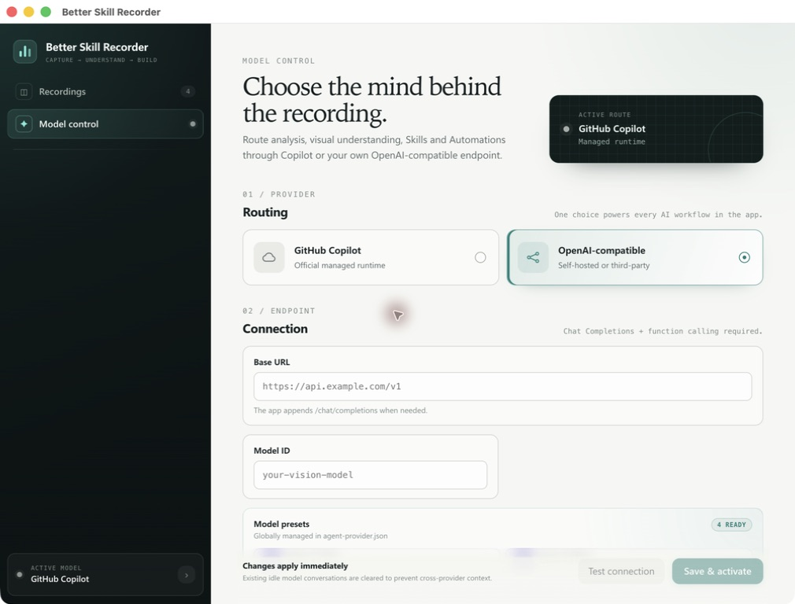
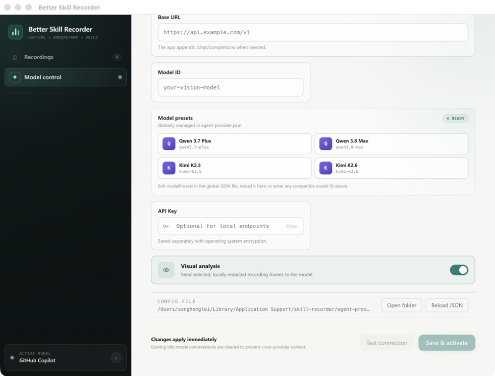

# Model configuration

Better Skill Recorder can route Analyze, analysis feedback, Skill Builder, and
Automation Builder through GitHub Copilot or one OpenAI-compatible Chat Completions
endpoint. Visual analysis is enabled by default for custom models.



## UI configuration

Open **Sessions → Model control**. The page can:

- select GitHub Copilot or a custom endpoint;
- set the Base URL and exact model ID;
- store an API key using Electron `safeStorage` (macOS Keychain / Windows DPAPI);
- enable or disable visual frame analysis;
- make a real endpoint + authentication + function-calling test (plus inline image
  transport when Visual analysis is enabled); and
- save and activate the provider without restarting the app.

Changing providers clears idle model conversations so feedback from one provider is
never resumed against another provider. A setting change is rejected while an Analyze
or Builder turn is active.

## JSON configuration

The UI displays the active configuration path. By default it is
`agent-provider.json` inside Electron's per-user application-data directory. Set
`SKILL_RECORDER_CONFIG_FILE` before launch to use a specific file instead.

Start from [`config/agent-provider.example.json`](../config/agent-provider.example.json):

```json
{
  "version": 1,
  "provider": "openai-compatible",
  "openaiCompatible": {
    "baseUrl": "https://api.example.com/v1",
    "model": "your-vision-model",
    "vision": true,
    "apiKeyEnv": "MY_SKILL_RECORDER_API_KEY",
    "modelPresets": [
      {
        "id": "your-vision-model",
        "label": "My Vision Model",
        "badge": "M",
        "source": "My provider",
        "verified": false,
        "capabilities": ["vision", "function-calling", "multi-turn-tools"]
      }
    ]
  }
}
```

`apiKeyEnv` names an environment variable; the key itself is not placed in the JSON
file. When the UI saves a key, encrypted bytes are written to a separate private file.
If secure storage is unavailable, the app refuses to persist the key and asks for the
`SKILL_RECORDER_OPENAI_API_KEY` environment variable instead.

After editing JSON while the app is open, choose **Reload JSON** on Model control.
Invalid files are reported without replacing the active configuration.

## Model presets

Model choices are not hard-coded in the page component. The packaged defaults come from
`common/model-presets.defaults.json`; each user's effective list lives in the global
`openaiCompatible.modelPresets` array shown above. Edit that array and choose **Reload JSON**
to add, remove, or rename choices without rebuilding the app. You can always type an exact
model ID that is not in the list.

Each preset accepts:

- `id` and `label`: required model ID and display name;
- `badge` and `source`: optional presentation metadata;
- `verified`: whether the model passed this project's compatibility protocol; and
- `capabilities`: optional tags. Selecting a preset tagged `vision` enables Visual analysis.

The packaged defaults currently contain `qwen3.7-plus`, `qwen3.8-max`, `kimi-k2.5`, and
`kimi-k2.6`. All four passed authentication, function calling, multi-turn tool execution,
and inline-image transport against Alibaba Cloud Token Plan during project validation.
Treat the badge as a tested baseline, not a permanent provider guarantee: deployments and
model aliases can change, so use **Test connection** with your own endpoint before activation.



## Precedence

Process environment has the highest priority, followed by JSON/UI settings, then the
Copilot default. The UI shows a banner when environment variables override saved fields.

Supported process-only overrides:

- `SKILL_RECORDER_AGENT_PROVIDER`
- `SKILL_RECORDER_OPENAI_BASE_URL`
- `SKILL_RECORDER_MODEL`
- `SKILL_RECORDER_OPENAI_VISION`
- `SKILL_RECORDER_OPENAI_API_KEY`

Remote endpoints require HTTPS. Plain HTTP is allowed only for `localhost`,
`127.0.0.1`, and `::1`. The Base URL may include `/chat/completions`; otherwise the app
appends it.

## Endpoint requirements

The custom endpoint must support OpenAI Chat Completions messages, function/tool calls,
and valid JSON function arguments. With Visual analysis enabled, it must also accept
`image_url` content containing `data:image/jpeg;base64,...` URLs.

The complete test protocol and current matrix are recorded in
[`OPENAI_COMPATIBLE_VALIDATION.md`](OPENAI_COMPATIBLE_VALIDATION.md).
